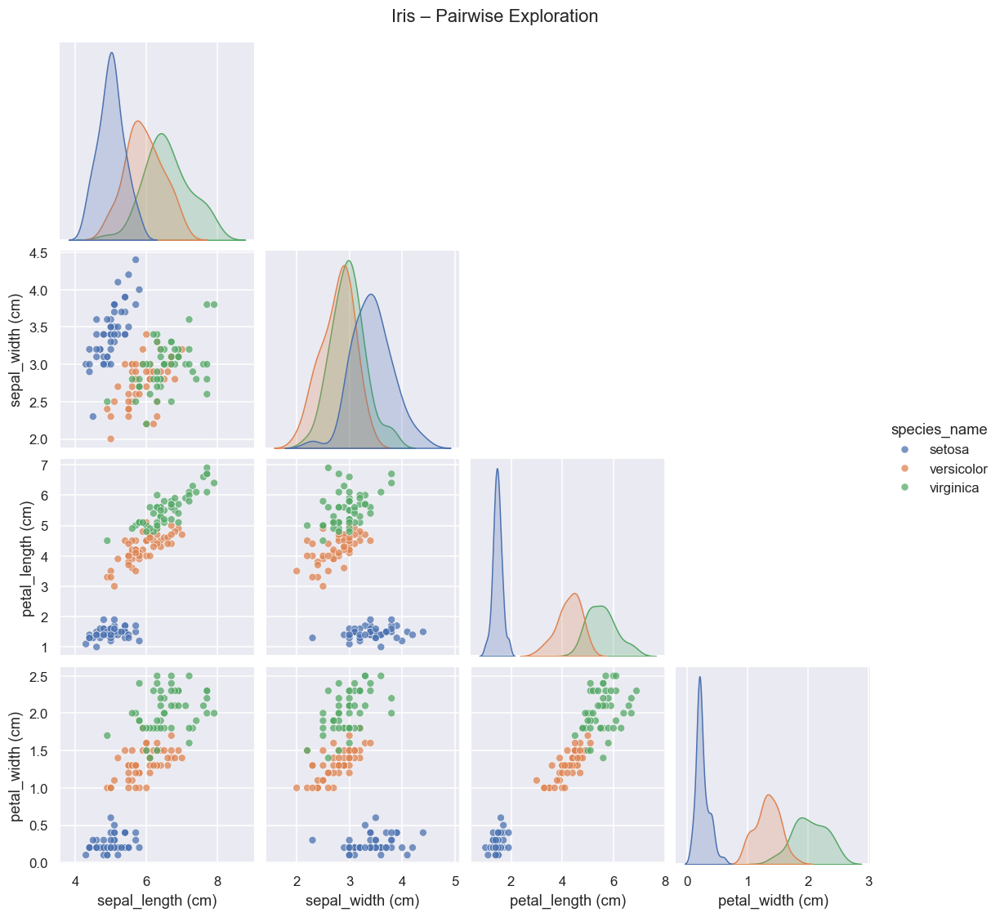
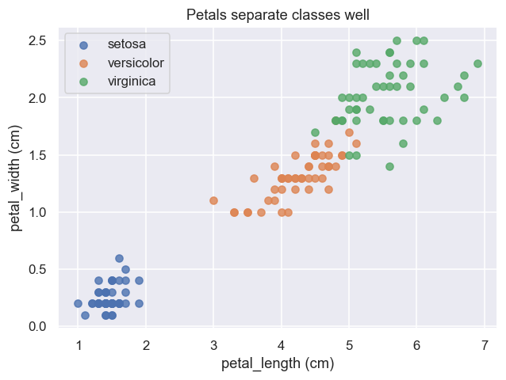
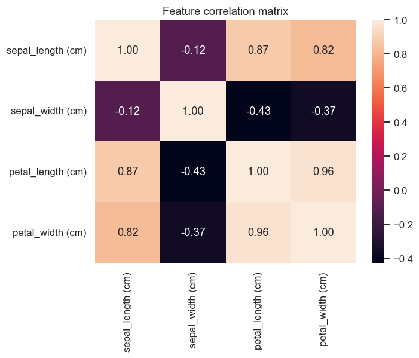
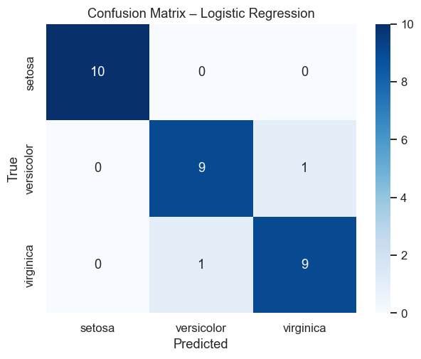

# 🌸 Iris Classifier – Machine Learning Project

This is my first end-to-end **Machine Learning project** using the classic **Iris dataset**.  
The goal is to explore the data, build baseline models, analyze errors, and package the model for later use.  

---

## 📂 Repository Structure
```
IRIS-CLASSIFIER/
├── notebooks/
│   ├── Iris_exploracion_ES.ipynb     # Exploratory analysis in Spanish
│   ├── Iris_exploration_EN.ipynb     # Exploratory analysis in English
│                    
├── src/
│   ├── train.py                      # Train and save model
│   ├── predict.py                    # Load model and run predictions
│   ├── common.py                     # Shared constants and paths
├── models/
│   └── model.joblib                  # Saved trained pipeline
├── data/                             # (optional – empty, Iris comes from sklearn)
├── requirements.txt
└── README.md
```
---

## 🎯 Objectives
- Understand the dataset and visualize patterns.  
- Train a **baseline Logistic Regression** model.  
- Compare with an alternative (KNN).  
- Analyze mistakes with a confusion matrix.  
- Save and reload the model for predictions.  

---

## 📊 Results

| Model                 | Accuracy |
|------------------------|----------|
| Logistic Regression    | ~0.97    |
| KNN (k=5)              | ~0.96    |

✅ Petal length & width separate classes very clearly.  
✅ Logistic Regression already achieves excellent performance.  
✅ KNN confirms separability of the dataset.  

---

## 🧾 Mini Model Card

**Model:** Logistic Regression (with scaling in pipeline)  
**Data:** Iris dataset (`sklearn.datasets.load_iris`)  
**Intended Use:** Educational / demo project (not for production).  
**Performance:** ~97% accuracy on held-out test set.  
**Limitations:**  
- Small toy dataset (150 samples).  
- Not robust to real-world flower classification.  
**Ethical Considerations:** None – dataset is public, non-sensitive.  

---

## 📸 Visual Highlights

### Pairplot (EDA)




### Confusion Matrix


---

## ⚙️ Tech Stack
- Python 3.10  
- scikit-learn 1.5+  
- pandas  
- seaborn  
- matplotlib  
- joblib  

---

## 🚀 Next Steps
- Add cross-validation and hyperparameter tuning (GridSearchCV).  
- Expand with 1–2 more algorithms (Decision Tree, SVM).  
- Write tests for `src/` scripts (pytest).  
- (Optional) Deploy with FastAPI or Streamlit for a live demo.  

---

## 💡 Why This Project

I built this project to:  
- Show **structured, reproducible ML workflows** (scripts + notebooks).  
- Demonstrate that I can **communicate results clearly** (EDA + model card).  
- Practice **good engineering habits** (repo structure, saved model, versioning).  
